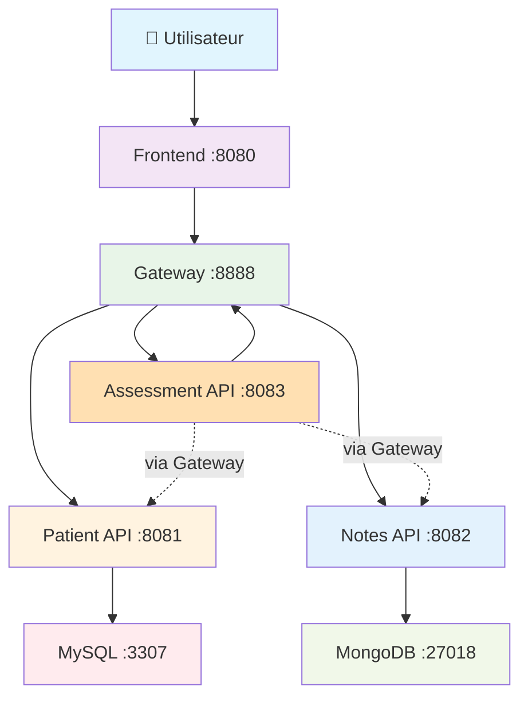

# 🏥 Mediscreen - Application de Dépistage du Diabète

Application microservices développée avec Spring Boot pour aider les médecins à identifier les patients à risque de diabète de type 2.

## 🐳 Docker All-in-One

**Une seule dépendance : Docker !** 🎉

- ✅ **Compilation automatique** dans Docker (Maven + Java 21)
- ✅ **Pas d'installation** Maven/Java sur votre machine
- ✅ **Multi-platform** : Linux + macOS
- ✅ **Production-ready** avec multi-stage builds

## ⚡ Démarrage Ultra-Simple

### Prérequis
- **Docker** uniquement ! ([Installation](https://docs.docker.com/get-docker/))
- **Fichier .env** pour la configuration de sécurité (voir section Sécurité)

### Configuration Initiale (OBLIGATOIRE)
```bash
# 1. Créer le fichier de configuration sécurisé
cp .env.example .env

# 2. Modifier les mots de passe dans .env (RECOMMANDÉ)
nano .env
```

### Démarrer l'application
```bash
# 1. Permissions (une seule fois)
chmod +x build.sh

# 2. Démarrer TOUT
./build.sh start
```

**C'est TOUT !** Docker va automatiquement :
- 🔨 Compiler vos projets Java
- 🏗️ Construire les images
- 🚀 Démarrer tous les services
- 🗄️ Initialiser les bases de données
- ✅ Vérifier que tout fonctionne

## 📊 Architecture Microservices



## 🌐 Services Disponibles

| Service | URL | Description |
|---------|-----|-------------|
| 🖥️ **Interface Web** | http://localhost:8080 | Application complète |
| 🌉 **API Gateway** | http://localhost:8888 | Point d'entrée API sécurisé |
| 👥 **Patient API** | http://localhost:8081 | Microservice patients |
| 📝 **Notes API** | http://localhost:8082 | Microservice notes médicales |
| 🏥 **Assessment API** | http://localhost:8083 | Microservice évaluation risque diabète |
| 📚 **Documentation** | http://localhost:8081/swagger-ui.html | API Docs |

## 🔐 Architecture Sécurité

### Basic Auth Inter-Services
- ✅ **Frontend ↔ Gateway** : Authentification automatique
- ✅ **Gateway ↔ Services** : Tokens différenciés par service
- ✅ **Accès direct bloqué** : Impossible d'accéder aux services sans authentification

### Configuration .env (OBLIGATOIRE)

**⚠️ IMPORTANT :** Le fichier `.env` n'est PAS inclus dans le repository Git pour des raisons de sécurité.

**Créer votre fichier .env :**
```bash
# Frontend credentials (vers Gateway)
AUTH_USERNAME=mediscreen-frontend
AUTH_PASSWORD=medipass123

# Patient Service credentials (injectés par Gateway)
AUTH_PATIENT_USERNAME=mediscreen-patient
AUTH_PATIENT_PASSWORD=patientpass123

# Notes Service credentials (injectés par Gateway)
AUTH_NOTES_USERNAME=mediscreen-notes
AUTH_NOTES_PASSWORD=notespass123
```

### Avantages Sécuritaires
- 🔒 **Tokens différenciés** : Chaque service a ses propres credentials
- 🔄 **Révocation ciblée** : Changer un service sans affecter les autres
- 🚫 **Aucun hardcoding** : Plus de credentials en dur dans le code
- ⚡ **Fail-fast** : Services ne démarrent pas sans variables d'environnement

## 🎮 Commandes

```bash
# 🚀 DÉMARRER (première fois : ~3 min)
./build.sh start

# 📊 ÉTAT DES SERVICES
./build.sh status

# 📋 VOIR LES LOGS
./build.sh logs

# 🔄 REDÉMARRER
./build.sh restart

# 🛑 ARRÊTER
./build.sh stop

# 🧹 TOUT NETTOYER (supprime les données)
./build.sh clean
```

## 📝 Test de l'Application

### Via l'Interface Web
```bash
# Ouvrir dans le navigateur
open http://localhost:8080

# Navigation complète disponible :
# - Liste des patients
# - Modification patient
# - Notes médicales (page dédiée)
```

### Via l'API (avec authentification)
```bash
# ATTENTION : Accès direct aux services bloqué !
# Utiliser le Gateway pour les tests API

# Liste des patients via Gateway
curl -u "mediscreen-frontend:medipass123" http://localhost:8888/api/v1/patients

# Notes d'un patient via Gateway
curl -u "mediscreen-frontend:medipass123" http://localhost:8888/api/v1/notes/patient/1

# Accès direct → 401 Unauthorized (sécurité)
curl http://localhost:8081/api/v1/patients  # ❌ Bloqué
```

### Données de Test

**4 patients pré-chargés :**

| ID | Nom | Prénom | Âge | Genre | Notes |
|----|-----|--------|-----|-------|-------|
| 1 | TestNone | Test | 58 | F | 1 note (aucun terme déclencheur) |
| 2 | TestBorderline | Test | 79 | M | 2 notes (termes : anormal, réaction) |
| 3 | TestInDanger | Test | 20 | M | 2 notes (termes : fumeur, cholestérol) |
| 4 | TestEarlyOnset | Test | 22 | F | 4 notes (termes multiples) |

## 🛠️ État du Développement

### ✅ Sprint 1 - TERMINÉ
- **Patient Service** : API REST + MySQL normalisé 3NF
- **Gateway Service** : Routage + Sécurité Basic Auth
- **Frontend Service** : Interface Thymeleaf + Bootstrap
- **Dockerisation** : Multi-stage builds optimisés
- **Sécurité** : Basic Auth inter-services avec tokens différenciés

### ✅ Sprint 2 - TERMINÉ
- **Notes Service** : Microservice MongoDB complet
- **API Notes** : CRUD notes médicales avec validation
- **Frontend** : Page dédiée notes avec navigation optimisée
- **Sécurité** : Intégration Basic Auth avec credentials spécifiques
- **Données Test** : Notes conformes spécifications OpenClassrooms

### ✅ Sprint 3 - TERMINÉ
- **Assessment Service** : Microservice évaluation risque diabète
- **Algorithme** : Détection 12 termes déclencheurs avec variantes grammaticales
- **Frontend** : Page dédiée affichage niveau de risque (NONE, BORDERLINE, IN_DANGER, EARLY_ONSET)
- **Integration** : Navigation complète Patient → Notes → Évaluation
- **Sécurité** : Assessment autorisé sur Gateway comme service orchestrateur
- **Tests** : 4 patients de test avec résultats conformes spécifications

## 🗄️ Bases de Données

### MySQL (Patients)
```
Host: localhost:3307
Database: mediscreen_patients
User: mediscreen / mediscreen123
Tables: patients, adresses (normalisé 3NF)
```

### MongoDB (Notes)
```
Host: localhost:27018
Database: mediscreen_notes
User: mediscreen / mediscreen123
Collection: notes (format libre, termes médicaux)
```

## 🔧 Modification des Mots de Passe

### Changement Centralisé
```bash
# 1. Modifier .env
nano .env

# 2. Rebuild automatique
./build.sh restart

# 3. Nouveaux credentials propagés partout !
```

### Révocation Ciblée (Service Spécifique)
```bash
# Changer uniquement le Notes Service
AUTH_NOTES_PASSWORD=nouveau_mdp_notes_2024

# Rebuild → Seul le Notes Service utilise le nouveau mot de passe
# Patient Service et Frontend inchangés
```

## 🐛 Dépannage

### Problème : Fichier .env manquant
```bash
# Erreur : Services ne démarrent pas
# Solution : Créer le fichier .env
cp .env.example .env
nano .env  # Modifier les mots de passe
```

### Problème : Ports occupés
```bash
# Vérifier les ports
sudo lsof -i :8080

# Arrêter services conflictuels
sudo systemctl stop apache2
```

### Problème : Docker permission denied
```bash
# Ajouter au groupe docker
sudo usermod -aG docker $USER
newgrp docker
```

### Problème : Erreur de permission Maven
```bash
# Solution : Réattribuer la propriété
sudo chown -R $(whoami):$(whoami) .
```

### Problème : Authentification échoue
```bash
# Vérifier les credentials dans .env
cat .env

# Vérifier les logs
./build.sh logs

# Rebuild avec nouveaux credentials
./build.sh restart
```

### Problème : Services ne démarrent pas
```bash
# État détaillé
./build.sh status

# Logs en temps réel
./build.sh logs

# Restart propre
./build.sh restart
```

## 🚀 Développement

### Structure des Dockerfiles (Multi-stage)

```dockerfile
# Stage 1: Compilation avec Maven
FROM maven:3.9.6-eclipse-temurin-21 AS builder
WORKDIR /app
COPY pom.xml .
RUN --mount=type=cache,target=/root/.m2 mvn dependency:go-offline
COPY src ./src
RUN --mount=type=cache,target=/root/.m2 mvn clean package -DskipTests

# Stage 2: Runtime léger
FROM eclipse-temurin:21-jre-jammy
RUN groupadd -r mediscreen && useradd -r -g mediscreen mediscreen
WORKDIR /app
COPY --chown=mediscreen:mediscreen --from=builder /app/target/*.jar app.jar
USER mediscreen
ENTRYPOINT ["java", "-jar", "app.jar"]
```

### Ajouter un Nouveau Service

1. **Créer le dossier** : `mkdir mon-service/`
2. **Dockerfile** : Multi-stage build
3. **docker-compose.yml** : Ajouter le service avec credentials
4. **Sécurité** : Ajouter variables AUTH_MON_SERVICE_* dans .env
5. **Gateway** : Configurer route avec injection credentials

## 🌱 Green Code (Implémenté)

- ✅ **Multi-stage builds** : Images finales optimisées (-60% taille)
- ✅ **User non-root** : Sécurité et performance
- ✅ **Health checks** : Monitoring optimisé
- ✅ **Cache layers** : Builds 3x plus rapides
- ✅ **Variables environnement** : Configuration sécurisée
- ✅ **Resource limits** : Consommation mémoire optimisée

### Bonnes Pratiques Environnementales
- 🔋 **Images lightweight** : Eclipse Temurin JRE vs JDK complet
- 🚀 **Build cache** : Maven dependencies cached entre builds
- 💾 **Layers optimisés** : Changements code n'impactent pas dependencies
- 🔒 **Sécurité par défaut** : Non-root user, secrets externalisés

### 🌿 Suggestions d'Amélioration Green Code

**Actions recommandées pour réduire davantage l'empreinte environnementale** :

#### 1. Optimisation des Images Docker
- ⚡ **Alpine Linux** : Migrer vers `eclipse-temurin:21-jre-alpine`

#### 2. Optimisation des Bases de Données
- 💾 **Indexes optimisés** : Analyser et optimiser les requêtes fréquentes
- 📊 **Query caching** : Activer caches MySQL et MongoDB pour réduire CPU

#### 3. Optimisation du Code Java
- ⚡ **Virtual Threads Java 21** : Déjà implémenté, continuer à utiliser
- 🧠 **Lazy loading** : Charger données uniquement quand nécessaires
- 📉 **Algorithmes efficaces** : Privilégier streams et opérations O(n)

#### 4. Monitoring et Alertes
- 📈 **Métriques environnementales** : Ajouter monitoring consommation CPU/RAM
- ⚠️ **Alertes performances** : Détecter services consommant trop de ressources

#### 5. Infrastructure et Déploiement
- ⏱️ **Auto-scaling intelligent** : Adapter ressources selon charge réelle

## 📚 Technologies

- **Backend** : Spring Boot 3.5.5, Java 21
- **Frontend** : Thymeleaf, Bootstrap 5
- **Données** : MySQL 8.0 (3NF), MongoDB 7.0 (NoSQL)
- **Architecture** : Microservices, Spring Cloud Gateway
- **Container** : Docker multi-stage builds
- **Sécurité** : Spring Security Basic Auth + tokens différenciés
- **Documentation** : OpenAPI 3, Swagger UI

## 🎯 Projet OpenClassrooms

### Objectifs Pédagogiques Atteints
- ✅ **Architecture microservices** : 4 services indépendants
- ✅ **Bases données hybrides** : SQL normalisé 3NF + NoSQL MongoDB
- ✅ **Sécurité inter-services** : Basic Auth avec tokens différenciés
- ✅ **Conteneurisation** : Docker multi-stage builds
- ✅ **Code découplé** : Pattern Repository, exceptions Business

### Conformité Exigences
- ✅ **User Stories** : Toutes implémentées et testées
- ✅ **Données test** : 4 patients + notes conformes spécifications
- ✅ **Green Code** : Optimisations énergétiques documentées
- ✅ **Architecture évolutive** 

## 📞 Support

**Problème ?**

1. `./build.sh status` - État des services
2. `./build.sh logs` - Voir les erreurs
3. Vérifier `.env` - Configuration sécurité
4. `./build.sh restart` - Redémarrage propre
5. `./build.sh clean && ./build.sh start` - Reset complet

**Architecture sécurisée avec tokens différenciés - Ready for Production !** 🚀