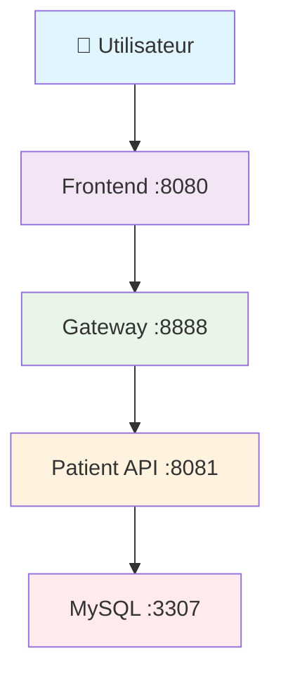

# 🏥 Mediscreen - Application de Dépistage du Diabète

Application microservices développée avec Spring Boot pour aider les médecins à identifier les patients à risque de diabète de type 2.

## 🐳 Docker All-in-One

**Une seule dépendance : Docker !** 🎉

- ✅ **Compilation automatique** dans Docker (Maven + Java 21)
- ✅ **Pas d'installation** Maven/Java sur votre machine
- ✅ **Multi-platform** : Linux + macOS  
- ✅ **Production-ready** avec multi-stage builds

## ⚡ Démarrage Ultra-Simple

### Prérequis
- **Docker** uniquement ! ([Installation](https://docs.docker.com/get-docker/))

### Démarrer l'application
```bash
# 1. Permissions (une seule fois)
chmod +x build.sh

# 2. Démarrer TOUT
./build.sh start
```

**C'est TOUT !** Docker va automatiquement :
- 🔨 Compiler vos projets Java
- 🏗️ Construire les images  
- 🚀 Démarrer tous les services
- 🗄️ Initialiser les bases de données
- ✅ Vérifier que tout fonctionne

## 📊 Architecture



## 🌐 Services Disponibles

| Service | URL | Description |
|---------|-----|-------------|
| 🖥️ **Interface Web** | http://localhost:8080 | Application complète |
| 🌉 **API Gateway** | http://localhost:8888 | Point d'entrée API |
| 👥 **Patient API** | http://localhost:8081 | Microservice patients |
| 📚 **Documentation** | http://localhost:8081/swagger-ui.html | API Docs |

## 🎮 Commandes

```bash
# 🚀 DÉMARRER (première fois : ~3 min)
./build.sh start

# 📊 ÉTAT DES SERVICES  
./build.sh status

# 📋 VOIR LES LOGS
./build.sh logs

# 🔄 REDÉMARRER
./build.sh restart

# 🛑 ARRÊTER
./build.sh stop

# 🧹 TOUT NETTOYER (supprime les données)
./build.sh clean
```

## 📝 Test de l'Application

### Via l'Interface Web
```bash
# Ouvrir dans le navigateur
open http://localhost:8080
```

### Via l'API
```bash
# Liste des patients
curl http://localhost:8081/api/v1/patients

# Patient par ID
curl http://localhost:8081/api/v1/patients/1

# Via le Gateway
curl http://localhost:8888/api/v1/patients
```

### Données de Test

**4 patients pré-chargés :**

| ID | Nom | Prénom | Âge | Genre | Risque |
|----|-----|--------|-----|-------|--------|
| 1 | TestNone | Test | 58 | F | None |
| 2 | TestBorderline | Test | 79 | M | Borderline |
| 3 | TestInDanger | Test | 20 | M | InDanger |
| 4 | TestEarlyOnset | Test | 22 | F | EarlyOnset |

## 🛠️ État du Développement

### ✅ Sprint 1 - TERMINÉ
- **Patient Service** : API REST + MySQL normalisé 3NF
- **Gateway Service** : Routage avec Spring Cloud Gateway
- **Frontend Service** : Interface Thymeleaf + Bootstrap
- **Dockerisation** : Multi-stage builds optimisés
- **Sécurité** : Spring Security

### 🚧 Sprint 2 - À Développer
- **Notes Service** : Microservice MongoDB
- **API Notes** : CRUD notes médicales
- **Frontend** : Affichage des notes

### 🚧 Sprint 3 - À Développer  
- **Assessment Service** : Évaluation risque diabète
- **Algorithme** : Détection termes déclencheurs
- **Frontend** : Affichage niveau de risque

## 🗄️ Bases de Données

### MySQL (Patients)
```
Host: localhost:3307
Database: mediscreen_patients
User: mediscreen / mediscreen123
```

### MongoDB (Notes - Sprint 2)
```
Host: localhost:27018
Database: mediscreen_notes
User: mediscreen / mediscreen123
```

## 🐛 Dépannage

### Problème : Ports occupés
```bash
# Vérifier les ports
sudo lsof -i :8080

# Arrêter services conflictuels
sudo systemctl stop apache2
```

### Problème : Docker permission denied
```bash
# Ajouter au groupe docker
sudo usermod -aG docker $USER
newgrp docker
```

### Problème : Erreur de permission Maven (Failed to delete / Permission non accordée)
Si vous rencontrez des erreurs de type "Failed to delete .../target" ou "Permission non accordée" lors de l'exécution de commandes Maven (comme `mvn clean`) ou depuis votre IDE, cela indique que des fichiers dans le répertoire `target` de votre projet ont été créés avec des permissions qui empêchent votre utilisateur actuel de les modifier ou de les supprimer. Cela peut arriver si Maven a été exécuté précédemment avec `sudo` ou par un autre utilisateur.

**Solution :** Réattribuez la propriété des fichiers de votre projet à votre utilisateur actuel. Exécutez la commande suivante dans le répertoire racine de votre projet :
```bash
sudo chown -R $(whoami):$(whoami) .
```
Remplacez `$(whoami)` par votre nom d'utilisateur si vous n'êtes pas sûr.

### Problème : Compilation échoue
```bash
# Voir les logs détaillés
./build.sh logs

# Rebuild complet
./build.sh clean
./build.sh start
```

### Problème : Services ne démarrent pas
```bash
# État détaillé
./build.sh status

# Logs en temps réel
./build.sh logs

# Restart propre
./build.sh restart
```

## 🚀 Développement

### Structure des Dockerfiles (Multi-stage)

```dockerfile
# Stage 1: Compilation avec Maven
FROM maven:3.9-openjdk-21-slim AS builder
WORKDIR /app
COPY pom.xml .
COPY src ./src
RUN ./mvnw clean package -DskipTests

# Stage 2: Runtime léger
FROM openjdk:21-jdk-slim
COPY --from=builder /app/target/*.jar app.jar
ENTRYPOINT ["java", "-jar", "app.jar"]
```

### Ajouter un Nouveau Service

1. **Créer le dossier** : `mkdir mon-service/`
2. **Dockerfile** : Multi-stage build
3. **docker-compose.yml** : Ajouter le service
4. **build.sh** : Le script s'adapte automatiquement

## 🌱 Green Code (À Implémenter)

- **Multi-stage builds** : Images finales plus petites
- **User non-root** : Sécurité et performance
- **Health checks** : Monitoring optimisé
- **Cache layers** : Builds plus rapides

## 📚 Technologies

- **Backend** : Spring Boot 3.5.5, Java 21
- **Frontend** : Thymeleaf, Bootstrap 5
- **Données** : MySQL 8.0, MongoDB 7.0
- **Architecture** : Microservices, API Gateway
- **Container** : Docker multi-stage builds
- **Sécurité** : Spring Security

## 📞 Support

**Problème ?**

1. `./build.sh status` - État des services
2. `./build.sh logs` - Voir les erreurs
3. `./build.sh restart` - Redémarrage propre
4. `./build.sh clean && ./build.sh start` - Reset complet