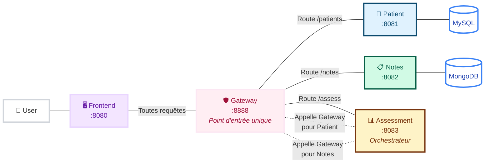

# Mediscreen - Application de Dépistage du Diabète

Application microservices Spring Boot pour identifier les patients à risque de diabète de type 2.

## Démarrage Rapide

**Prérequis : Docker uniquement**

```bash
# 1. Configurer les credentials
cp .env.example .env
nano .env  # Remplir les mots de passe

# 2. Démarrer l'application
chmod +x build.sh
./build.sh start
```

L'application est accessible sur http://localhost:8080

## Architecture



| Service | Port | Description |
|---------|------|-------------|
| Frontend | 8080 | Interface web Thymeleaf |
| Gateway | 8888 | Point d'entrée API sécurisé |
| Patient | 8081 | Gestion patients (MySQL 3NF) |
| Notes | 8082 | Notes médicales (MongoDB) |
| Assessment | 8083 | Évaluation risque diabète |

## Commandes

```bash
./build.sh start    # Démarrer tous les services
./build.sh stop     # Arrêter
./build.sh restart  # Redémarrer
./build.sh logs     # Voir les logs
./build.sh status   # État des services
./build.sh clean    # Supprimer données et images
```

## Sécurité

Architecture Basic Auth avec tokens différenciés :
- Chaque microservice a ses propres credentials
- Gateway injecte automatiquement les bons tokens
- Accès direct aux services bloqué (401)

Configuration via `.env` (voir `.env.example`).

## Tests

**113 tests automatisés** couvrant tous les services :

```bash
mvn clean test                    # Tous les tests
cd patient-service && mvn test    # Par service
```

| Service | Tests | Couverture |
|---------|-------|------------|
| Patient | 31 | Controllers, Services, Repository |
| Notes | 27 | Controllers, Services, Repository |
| Assessment | 41 | Algorithme, Orchestration, 4 cas OpenClassrooms |
| Gateway | 12 | Routage, Sécurité |
| Frontend | 2 | Application context |

## Données de Test

4 patients conformes aux spécifications OpenClassrooms :

| Patient | Âge | Résultat attendu |
|---------|-----|------------------|
| TestNone | 58 ans, F | None |
| TestBorderline | 79 ans, M | Borderline |
| TestInDanger | 20 ans, M | In Danger |
| TestEarlyOnset | 22 ans, F | Early Onset |

## Green Code

**Optimisations implémentées :**
- Multi-stage Docker builds (images JRE légères)
- Cache Maven pour builds rapides
- Utilisateur non-root dans containers
- Architecture SRP : séparation orchestration/calcul (-50% appels API)
- Healthchecks optimisés

**Améliorations suggérées :**
- Migration vers Alpine Linux
- Lazy loading des données
- Cache queries bases de données

## Stack Technique

- **Backend** : Spring Boot 3.5.5, Java 21
- **Frontend** : Thymeleaf, Bootstrap 5
- **Données** : MySQL 8.0 (3NF), MongoDB 7.0
- **Infra** : Docker multi-stage, Spring Cloud Gateway
- **Sécurité** : Spring Security Basic Auth

## Bases de Données

```
MySQL  → localhost:3307  (mediscreen_patients)
MongoDB → localhost:27018 (mediscreen_notes)
User: mediscreen
```

## Dépannage

```bash
./build.sh status              # Vérifier l'état
./build.sh logs                # Consulter les erreurs
./build.sh restart             # Redémarrage propre
./build.sh clean && ./build.sh start  # Reset complet
```

---